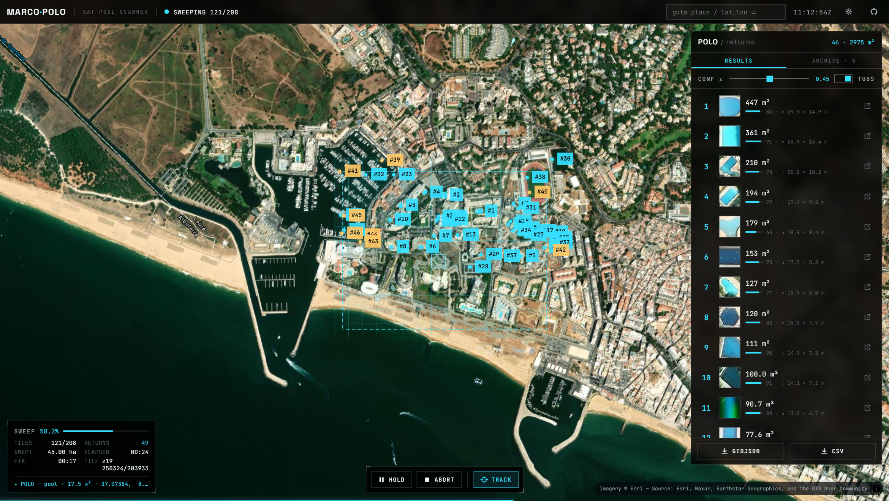

<div align="center">

# MARCO · POLO

**A visual geospatial scanner that finds swimming pools from space.**

Draw an area on a satellite map. The scanner sweeps it tile by tile — calling *marco* —
and every pool that answers *polo* gets detected, measured, geolocated, deduplicated
and ranked, live, in front of you.

[**Live demo**](https://sepd0x.github.io/marco-polo/) ·
[How it works](#how-it-works) ·
[Run it locally](#run-it-locally) ·
[CLI](#headless-cli) ·
[Docs](docs/)




</div>

---

## What it does

Swimming pools are one of the most distinctive man-made signatures visible from orbit:
chlorinated water over a light liner reflects a narrow band of cyan that almost nothing
else in the built environment produces. **Marco Polo** exploits that physical signature
to run a full geospatial survey pipeline entirely in your browser:

- **Draw** any search area — rectangle or free polygon — on a satellite map.
- **Scan**: the engine computes the exact Web Mercator tile set covering your polygon,
  sweeps it in a serpentine (or spiral) traversal, and streams every tile through a
  computer-vision pipeline running in Web Workers.
- **Watch**: the sweep is fully live — tile grid, pulsing scan head, radar pings as
  detections land, a ranked list that reorders in real time, telemetry with coverage,
  ETA and an event ticker. Long scans are the point, not a problem.
- **Inspect**: every detection has a real imagery thumbnail, an estimated surface area
  in m², an approximate width × length, a confidence score, exact coordinates, and a
  one-click jump to Google Maps / the map itself.
- **Export & share**: ranked GeoJSON and CSV, straight from the browser. Completed
  scans are archived locally (IndexedDB) and survive reloads, and the drawn area
  lives in the URL — send a permalink and anyone reproduces your exact search area.
- **Anywhere**: desktop instrument layout or a mobile bottom-sheet UI with touch
  drawing. Re-scans run ~10× faster from the local tile cache. Imagery is pluggable —
  keyless Esri World Imagery by default, or your own MapTiler/Mapbox key or any XYZ
  endpoint.

No backend. No API keys required. No model weights to download. Clone, install, scan.

## Why it's technically interesting

Most "detect X in satellite images" projects are a notebook and a pretrained model.
Marco Polo is an end-to-end *instrument*:

1. **Pure-TypeScript computer vision.** Detection is classical CV built from first
   principles in [`@marco-polo/core`](packages/core): HSV water-signature segmentation
   with a joint saturation/brightness gate (pale pools are bright, deep pools are
   saturated — asphalt shadow is neither), a surface-smoothness test (water is glassy;
   hedges and solar arrays are textured), morphological open/close, 8-connected
   component labelling, and lattice-edge contour tracing with Douglas-Peucker
   simplification. Zero dependencies; the same code runs in browser workers and Node.

2. **Real geodesy.** Pixels become polygons on the Earth: per-latitude ground
   resolution from the Web Mercator scale factor, pixel→WGS84 projection, geodesic
   area estimation, and tile-coverage computation for arbitrary polygons.

3. **Cross-tile deduplication.** A pool that straddles tile boundaries is detected as
   fragments in two (or four) tiles. A spatially-indexed merger joins fragments whose
   geographic bounds meet across facing edges, re-emits merged detections live, and
   tracks *truncation* — a shape is only flagged "may extend further" while its
   continuation is genuinely unknown.

4. **Honest confidence.** Every detection is scored on colour evidence, shape
   compactness and size plausibility. False-positive lookalikes (teal roofs, blue
   tarps) surface with visibly low confidence and are filtered by a threshold you
   control — nothing is silently discarded or invented.

5. **A scan is a spectacle.** The product treats a long-running geospatial survey as
   something worth watching: traversal orders chosen for spatial locality, an
   auto-following camera, detections pinging in with their measured area, rankings
   shifting as bigger pools answer.

See [docs/DETECTION.md](docs/DETECTION.md) for the full pipeline with the actual
thresholds and the reasoning behind them, and
[docs/ARCHITECTURE.md](docs/ARCHITECTURE.md) for the system design.

<div align="center">

</div>

## Run it locally

Requirements: **Node 20+**.

```bash
git clone https://github.com/Sepd0x/marco-polo.git
cd marco-polo
npm install
npm run dev        # → http://localhost:5173
```

Draw an area (or hit one of the demo chips — Vilamoura, Scottsdale, Marbella,
Palm Springs) and press **START SCAN**.

```bash
npm test           # core engine unit tests (geodesy, CV, merging)
npm run typecheck  # strict TS across all packages
npm run build      # production build of the web app
```

## Headless CLI

The same engine, no browser — useful for batch surveys and reproducible output:

```bash
# bounding box: south,west,north,east
npm run scan -- --bbox "37.070,-8.125,37.079,-8.106" --out ./scans/vilamoura

# or any GeoJSON polygon
npm run scan -- --area ./area.geojson --zoom 19 --rate 5 --order spiral
```

```
marco polo — scanning 208 tiles @ z19 (0.63 km²)
  POLO  pool     455.0 m²  conf 0.94  37.076011, -8.118400
  POLO  pool     138.6 m²  conf 0.82  37.075064, -8.116005
  marco? tile 173/208 (83.2%) · 61 found · eta 8s
```

Outputs ranked `.geojson` + `.csv` with per-pool coordinates, area, confidence and a
Google Maps link. Tiles are cached on disk (`.tile-cache/`), so re-scans are instant
and polite to the imagery provider.

## Repository layout

```
marco-polo/
├── packages/core     # the engine: geodesy, CV, merging, ranking — pure TS, zero deps
├── packages/cli      # headless scanner (Node)
├── apps/web          # the instrument: MapLibre GL + React + Web Workers
└── docs/             # architecture, detection deep-dive, imagery policy
```

## Imagery, rate limits & responsible use

- Default imagery is **Esri World Imagery** (used with attribution; tiles fetched at a
  configurable, deliberately low rate with local caching). Any XYZ endpoint can be
  substituted in Settings — see [docs/IMAGERY.md](docs/IMAGERY.md) for terms and
  alternatives.
- The tool analyses **publicly available imagery** that anyone can view in a browser;
  it does not access anything private. Still: aggregate insight is the intended use.
  Don't use it to profile individual properties or people. Read
  [docs/IMAGERY.md](docs/IMAGERY.md#responsible-use) before deploying it anywhere
  serious.
- Detection quality varies with imagery age, sun angle, water colour and shadow.
  Areas are *estimates* (pixel counts × ground resolution), typically within ~10–15%
  on clear imagery. Confidence tells you how much to trust each detection —
  surface it, don't hide it.

## Contributing & continuing the work

- [CONTRIBUTING.md](CONTRIBUTING.md) — setup, code rules, the detection-evidence rule.
- [CLAUDE.md](CLAUDE.md) — the agent/contributor field guide: architecture map,
  commands, and every hard-won gotcha in this codebase.
- [docs/ROADMAP.md](docs/ROADMAP.md) — prioritised, fully-specified next steps
  (resumable scans, imagery time-travel via Esri Wayback, scan diffing, ONNX
  detector plug-in, PWA…).

## License

[MIT](LICENSE) — © Sepd0x.
